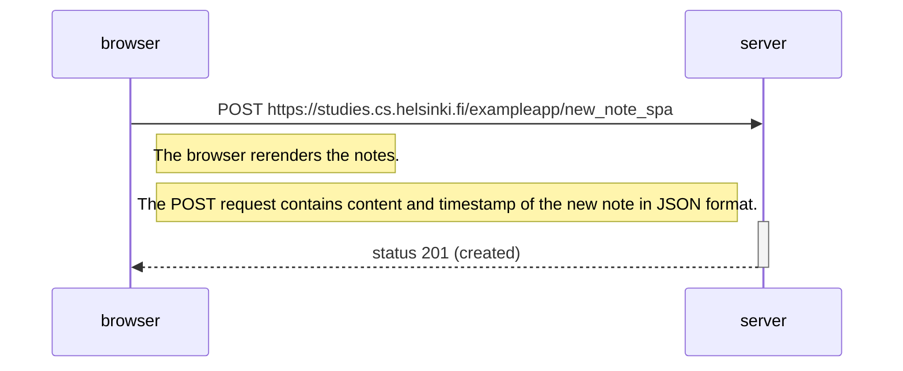

```mermaid
sequenceDiagram
    participant browser
    participant server

    browser->>server: POST https://studies.cs.helsinki.fi/exampleapp/new_note_spa

    Note right of browser: The browser rerenders the notes.
    Note right of browser: The POST request contains content and timestamp of the new note in JSON format.

    activate server    
    server-->>browser: status 201 (created)
    deactivate server
```
